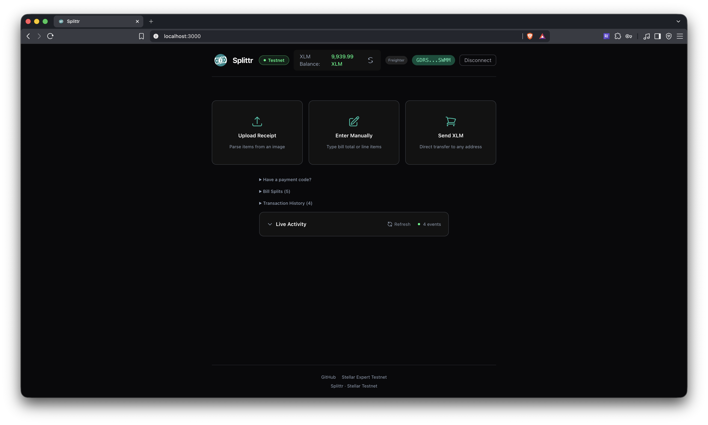
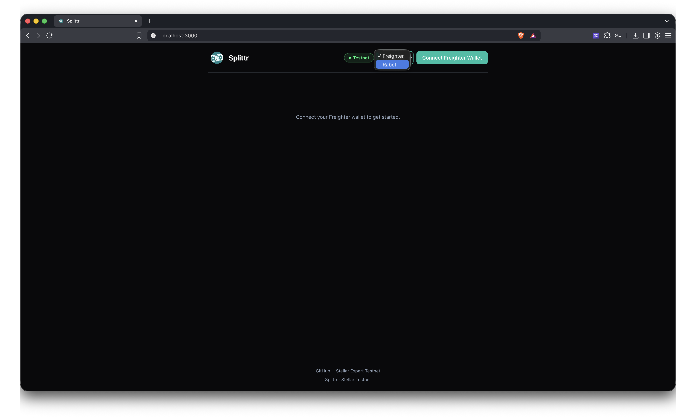
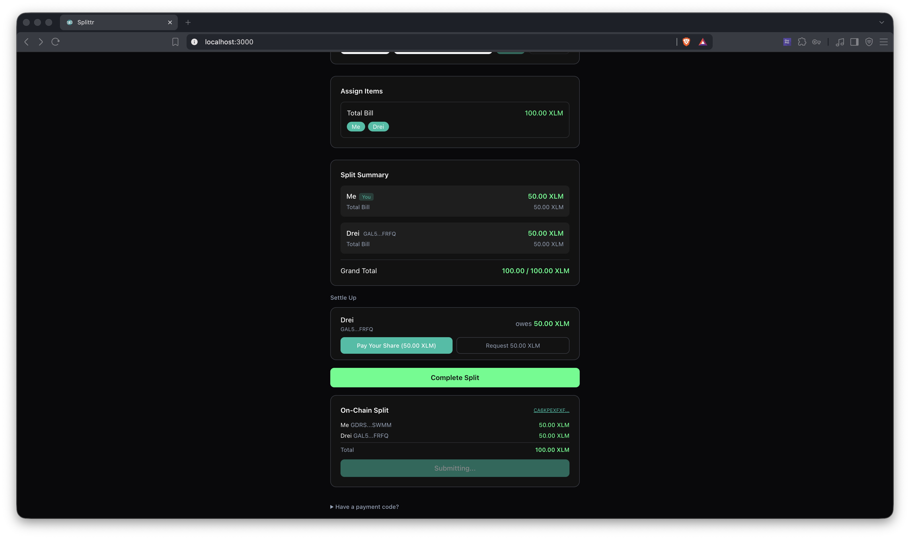
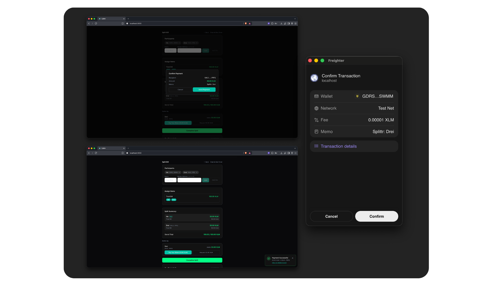
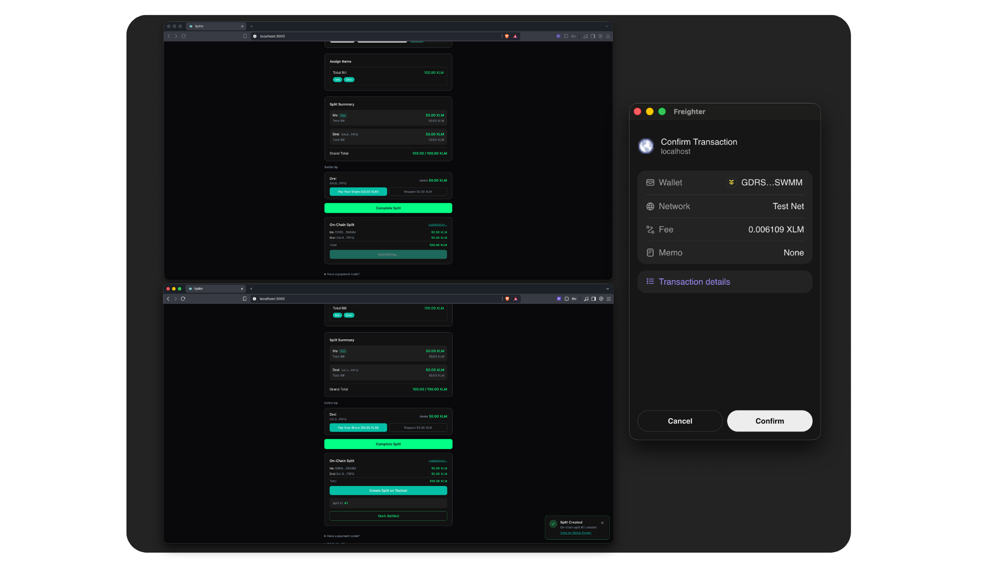
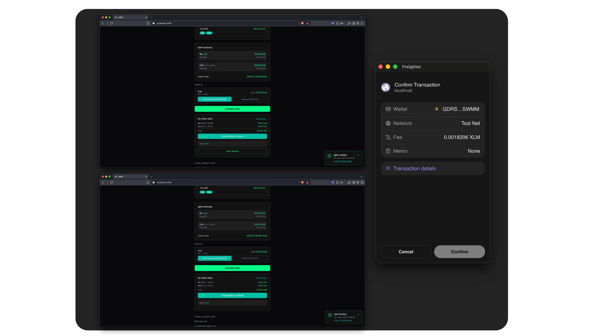
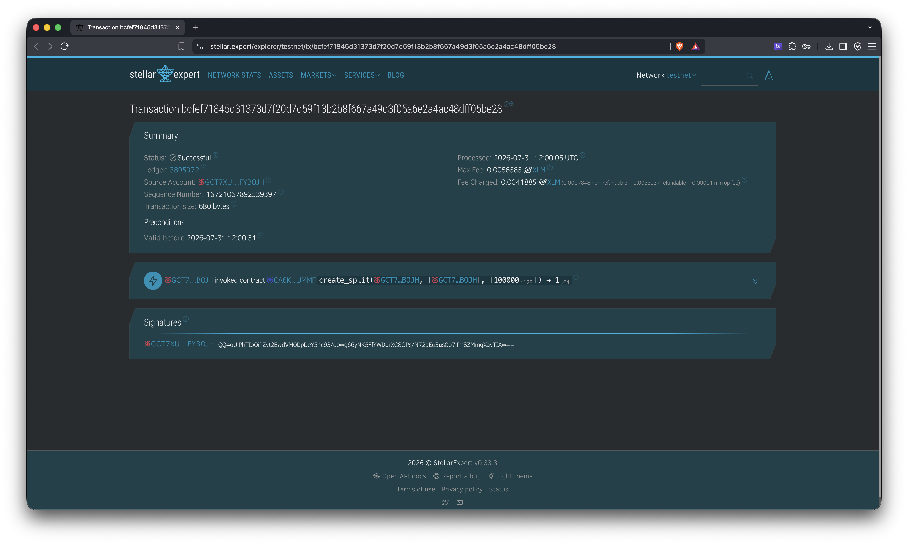
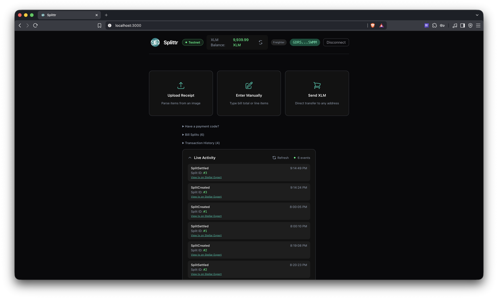

# Splittr

Splittr is a Web3 bill-splitting application built on the Stellar Testnet. Upload a receipt or enter items manually, split costs among participants, and settle payments instantly in XLM — all on-chain with a Soroban smart contract.

## Features

- **Receipt OCR** — upload a receipt image and extract line items via AI parsing (Gemini)
- **Manual entry** — add items by name and price, or set a flat total
- **Itemized splitting** — assign each item to one or more participants, with live per-person totals
- **Multi-wallet support** — connect via Freighter or Rabet
- **XLM payments** — send native XLM directly to participants from the app
- **Soroban on-chain splits** — create and settle splits via the `Split` contract on Testnet
- **Real-time event feed** — poll-based activity log with contract events, refresh, and error handling
- **Transaction status** — track pending → success / failed lifecycle for every payment

## Project Structure

```
.
├── contracts/split             Soroban Split smart contract (Rust)
├── docs/
│   ├── FEATURES.md             Feature specification
│   ├── UI_SPEC.md              UI/UX specification
│   ├── ReadMe-Reference.md     README formatting reference
│   └── assets/                 Screenshots for README
├── scripts/
│   ├── deploy-contract.ts      Deploy Split contract to Testnet
│   ├── test-events.ts          Test contract event fetching
│   └── test-invoke.ts          Test contract invocation
├── src/
│   ├── app/
│   │   ├── api/parse-receipt/  OCR endpoint (Gemini)
│   │   ├── globals.css
│   │   ├── layout.tsx
│   │   └── page.tsx            Main application page
│   ├── components/
│   │   ├── BalanceDisplay.tsx
│   │   ├── ContractSplitForm.tsx
│   │   ├── DirectSendForm.tsx
│   │   ├── EventFeed.tsx
│   │   ├── ItemizedSplitter.tsx
│   │   ├── ManualBillInput.tsx
│   │   ├── PaymentModal.tsx
│   │   ├── ReceiptUploader.tsx
│   │   ├── Toast.tsx
│   │   ├── TransactionStatusPanel.tsx
│   │   └── WalletConnect.tsx
│   └── lib/
│       ├── contract.ts         Soroban RPC helpers
│       ├── errors.ts
│       ├── ocr.ts              OCR parsing utilities
│       ├── stellar.ts          Horizon / transaction helpers
│       └── wallets/            Freighter & Rabet adapters
├── AGENTS.md
├── package.json
└── README.md
```

## Deployed Contracts (Testnet)

| Contract | Address | Notes |
| --- | --- | --- |
| Split | `CA6KPEXFXFNJTQSZHICOVF65BP4EQU7UO6YWTGE6ESOFSJQ663CXJMMF` | Soroban bill-splitting contract — create and settle splits on Testnet |

A verifiable contract call transaction hash is shown in the [screenshots](#contract-call) below.

## Prerequisites

- [Node.js](https://nodejs.org/) 20+ (LTS recommended)
- [pnpm](https://pnpm.io/) 9+
- [Rust](https://rustup.rs/) with `wasm32v1-none` target:
  ```bash
  rustup target add wasm32v1-none
  ```
- A Stellar Testnet wallet (e.g., [Freighter](https://www.freighter.app/), [Rabet](https://rabet.io/))

## Install

```bash
pnpm install
```

## Configure

Create a `.env.local` file in the project root:

```bash
cp .env.example .env.local
```

| Variable | Description |
| --- | --- |
| `NEXT_PUBLIC_SPLIT_CONTRACT_ID` | Deployed Split contract ID on Testnet |
| `NEXT_PUBLIC_CONTRACT_START_LEDGER` | Ledger number at which the contract was deployed |
| `GEMINI_API_KEY` | Google Gemini API key for receipt OCR parsing |
| `DEPLOYER_SECRET_KEY` | Stellar Testnet secret key for contract deployment |

## Build & Deploy Contract

Build the Soroban contract:

```bash
pnpm build:contract
```

Deploy to Stellar Testnet (auto-funds via Friendbot if needed):

```bash
pnpm deploy:contract
```

The script writes `NEXT_PUBLIC_SPLIT_CONTRACT_ID` and `NEXT_PUBLIC_CONTRACT_START_LEDGER` to `.env.local`. To overwrite an existing deployment:

```bash
pnpm deploy:contract -- --force
```

Restart the dev server after deployment so the new contract ID is loaded.

## Run the App

```bash
pnpm dev
```

Open `http://localhost:3000`. Connect your Freighter or Rabet wallet to start splitting bills.

## Scripts

```bash
pnpm dev              # Start the dev server
pnpm build            # Build for production
pnpm start            # Start production server
pnpm lint             # Run ESLint
pnpm build:contract    # Build the Soroban Split contract
pnpm deploy:contract   # Deploy the Split contract to Testnet
```

## Screenshots

### Wallet Connected



### Wallet Options



### Split Bill



### Successful Testnet Transaction



### Contract Interaction — Split Created



### Contract Interaction — Split Settled



### Contract Call



### Live Activity



## License

UNLICENSED — this project is in active development.
